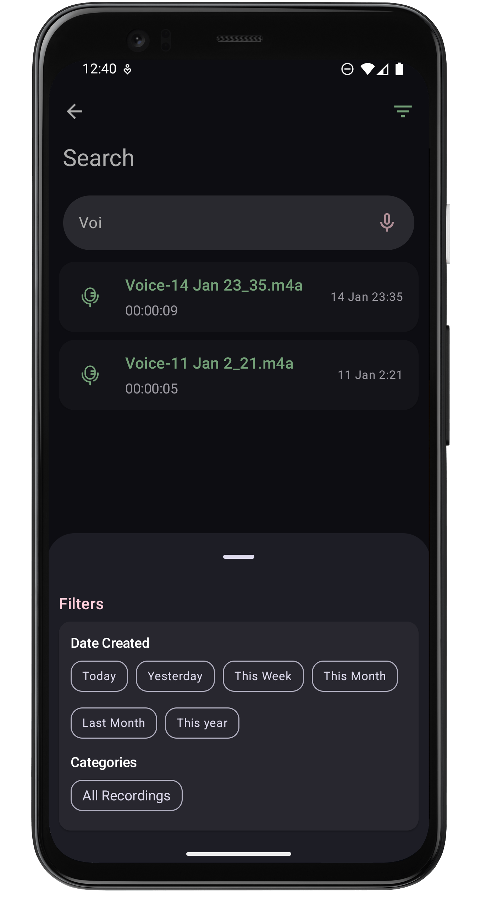
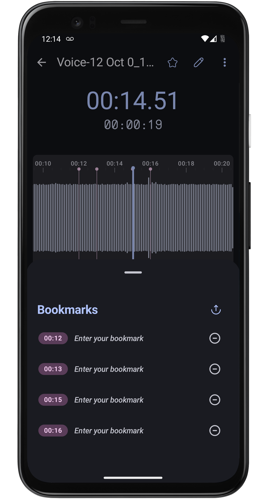

# :studio_microphone: RecorderApp

An android audio recorder app, designed to simplify the process of capturing and managing
recordings.
With a clean and intuitive interface, this app offers a seamless user experience.

## 💁 About

A fully functioned recorder app with an ability to record over multiple media codec like **acc**,\*
\*amr**,**opus\*\* over different quality. The app can continue its recording in the background, so you
never miss a moment. Once the recording, you can easily manage your files within the app.
There `built-in player`, you can listen to your recordings directly within the app or use the
convenient media notification for playback control.
Want to remove certain section of your recordings, use the audio editor that allows you to easily
cut and trim unwanted sections.
The apps also features creating `category` for the recordings the categories help to keep the
recording organized, you can also add `bookmarks` to the portion of the recording.

### :building_construction: Features

What are the features this app can provide, here's some:

- :musical_keyboard: **Effortless Recording**: Start recording instantly with a single tap of a
  button.
- :chart_with_upwards_trend: **Real time Visualization**: Watch the amplitude levels fluctuate in
  real-time as you record or play the media.
- :loop: **Background Recording**: Keep recording even when you switch to other apps or lock your
  device.
- :bellhop_bell: **Convenient Notifications**: Control your recordings directly from
  notifications,without having to return to the app.
- :file_cabinet: **File Management**: Organize, delete, share, or rename your own recordings with
  ease, on api level `api-31`+ you can also read other apps recordings.
- :package: **Category Management**: Categories your recording into different category, so that you
  can easily find the required one.
- :record_button: **Built-in Player**: Listen to your recordings directly within the app, complete
  with a media notification for easy playback control.
- 👨‍🍳 **Build in Editor** : Seamlessly trim and cut section of your recording or other files.
- :bookmark: **Bookmarks** : You can add multiple bookmarks with the recording to easily remember
  the important portions of your recording. You can too export the bookmarks as csv file.
- :eight_spoked_asterisk: **Widgets And Shortcuts** : App comes with two `widgets` and few
  `shortcuts` to ease the experience of the user.

## 📷 Screenshots

These are some screen shorts for the app

<p align="center">

   
   
   
   
   
   
   
   
</p>

For more [screenshots](./screenshots).

## :safety_pin: Permissions

Basically, Android is a bit of a control freak when it comes to apps. It's all about keeping your
phone safe and sound.Here are the list of permission required in this app

- :microphone: **Record Audio** : Use to record voices and other sounds
- :musical_note: **Music and Audio Access** : Use to save and read the recordings
- :bell: **Notifications** : Yes you can control the recorder from the notification

There are some optional permissions, but they aren't necessary to the core audio recording and
playing stuff.

- :telephone_receiver: **Phone State** : To handle incomming calls during a recording.
- :world_map: **Location** : Some mediacodec like `acc` and `three_gpp` can add a additional
  location data with the recording.You can view this location data on other devices which can read
  metadata.

## :new: What's new

This update introduces a **built-in Audio Editor** alongside significant enhancements to the player:

- **✂️ Unleash Your Inner Editor:** Now you can precisely `trim` and `cut` your recordings directly
  within the app! Remove unwanted sections and refine your audio effortlessly.
- 💾 **Save Your Edits:** Preserve your edited masterpieces! The app now allows you to **save the
  modified audio files** to your device's storage.
- ⏯️ **Dedicated Editor Player:** A **secondary player** is integrated within the editor, providing
  you with focused playback control during the editing process, with undo and redo options to
  reapply your edits.
- 🚀 **Under the Hood Improvements:** Fix issues with visualization via `new-visualizer` logic. A new
  speed selected UI is added to the player and others.

This update is all about giving you more control over your recordings, from capture to refinement.

## :next_track_button: What's next

For the time being, RecorderApp encompasses all initially planned features and is considered
complete. Future releases are not currently scheduled.

If you have any new ideas or suggestions for enhancements, we encourage you to create a
new [Issue](https://github.com/tuuhin/RecorderApp/issues) on GitHub.

We are considering potential additions to the audio editor, such as audio processors like `db-gain`
and `low-pass-filter`.

## :hammer_and_wrench: Getting Started

Here are the steps to get started with this app:

1. **Clone the Repository:**

   ```bash
   git clone https://github.com/tuuhin/RecorderApp.git
   ```

2. **Open Project**
   Open the project in android studio

3. **Build and Run**
   Build and run on android device with api 29 and above

You have your app running this is just simple as that.

### :woman_cook: Contributing

Contributions are always welcomed from the community

- Fork the repository.
- Create your feature branch (git checkout -b feature/YourFeature).
- Commit your changes (git commit -am 'Add some feature').
- Push to the branch (git push origin feature/YourFeature).
- Submit a request to merge your changes onto `dev` branch of main project.

### :curly_loop: Feedback and Support

A app is never perfect there may issue here and there which are not caught.If you encounter any
issues, have suggestions for new features, or just want to share your thoughts, please don't
hesitate to reach out by creating a new [Issue](https://github.com/tuuhin/RecorderApp/issues) on
GitHub. Your feedback is invaluable!

### :end: Conclusion

The app can be marked as finished for now.A significant amount of time and effort has been invested
in this project hope you all love it.
