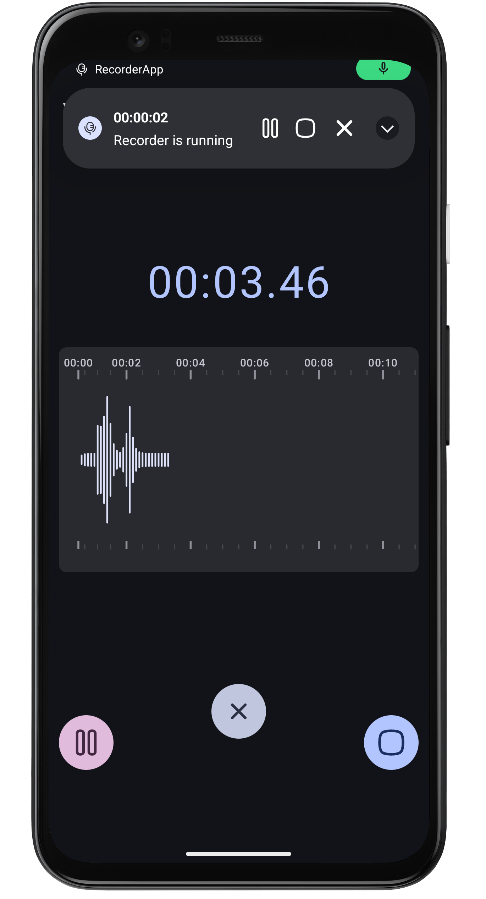
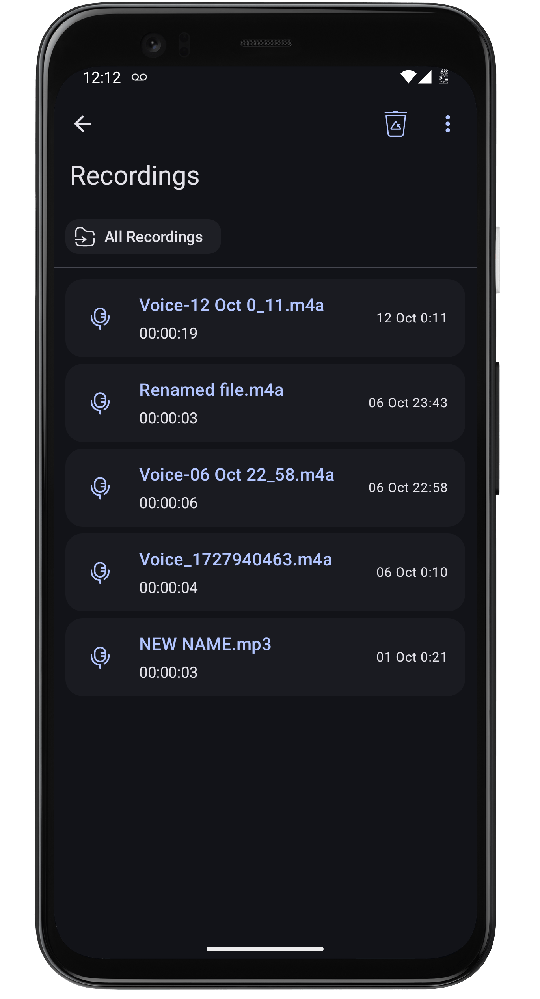

# :studio_microphone: RecorderApp

An android audio recorder app, designed to simplify the process of capturing and managing your sound
recordings.
With a clean and intuitive interface, this app offers a seamless user experience.

## 💁 About

A fully functioned recorder app with an ability to record over multiple file formats like **acc**,*
*amr**,**opus** over different quality. The app can continue its recording in the background, so
you never miss a moment.
Once the recording, you can easily manage your files within the app. There built-in player, you can
listen to your recordings directly within the app or use the convenient media notification for
playback control.

### :building_construction: Features

What are the features this app can provide, here's some:

- :musical_keyboard: **Effortless Recording**: Start recording instantly with a single tap on the
  record button.
- :medal_military: **Visualization**: Watch the amplitude levels fluctuate in real-time as you
  record.
- :running_man: **Background Recording**: Keep recording even when you switch to other apps or lock
  your device.
- :bellhop_bell: **Convenient Notifications**: Control your recordings directly from
  notifications,without having to return to the app.
- :file_cabinet: **File Management**: Organize, delete, share, or rename your recordings with ease.
- :record_button: **Built-in Player**: Listen to your recordings directly within the app, complete
  with a media notification for easy playback control.

## 📷 Screenshots

Some sneak peaks of the app design

<p align="center">
   
   
   
   
</p>

For more [screenshots](./screenshots).

## :safety_pin: Permissions

Basically, Android is a bit of a control freak when it comes to apps. It's all about keeping your
phone safe and sound.Here are the list of permission required in this app

- :microphone: **Record Audio** : Use to record voices and other sounds
- :musical_note: **Music and Audio Access** : Use to save and read the recordings
- :bell: **Notifications** : Yes you can control the recorder from the notification

There are some other permissions (optional ones), but they aren't necessary to the core audio
recording and playing stuff.

- :telephone_receiver: **Phone State** : To handle incomming calls during a recording.

## :hammer_and_wrench: Getting Started

Here are the steps to get started with this app:

1. **Clone the Repository:**

   ```bash
   git clone https://github.com/tuuhin/RecorderApp.git
   ```

2. **Open Project**
   Open the project in android studio

3. **Build and Run**
   Build and run on android device with api 29 and above

You have your app running this is just simple as that.

### :woman_cook: Contributing

Contributions are always welcomed from the community

- Fork the repository.
- Create your feature branch (git checkout -b feature/YourFeature).
- Commit your changes (git commit -am 'Add some feature').
- Push to the branch (git push origin feature/YourFeature).
- Create a new Pull Request.

### :curly_loop: Feedback and Support

Yes, there maybe some issues regarding the app or some unwanted scenario. Please add
an [issue](https://github.com/tuuhin/RecorderApp/issues) if you have one.

### :next_track_button: What's next

This app will in further development with few new features planned.
