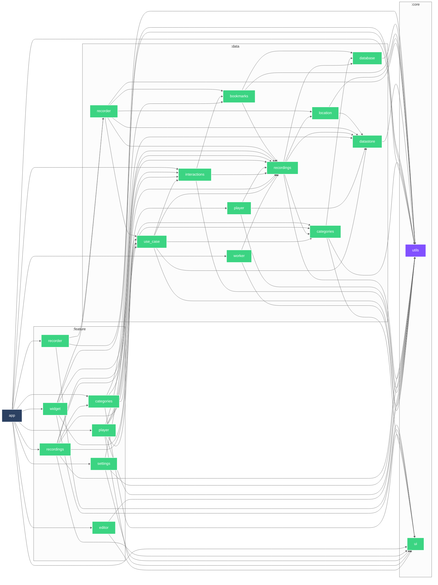

# Module Graph

```mermaid
%%{
  init: {
    'theme': 'neutral'
  }
}%%

graph LR
  :app["app"]
  subgraph :data
    :data:worker["worker"]
    :data:recordings["recordings"]
    :data:use_case["use_case"]
    :data:interactions["interactions"]
    :data:datastore["datastore"]
    :data:categories["categories"]
    :data:player["player"]
    :data:bookmarks["bookmarks"]
    :data:use_case["use_case"]
    :data:interactions["interactions"]
    :data:player["player"]
    :data:recordings["recordings"]
    :data:database["database"]
    :data:location["location"]
    :data:worker["worker"]
    :data:categories["categories"]
    :data:recorder["recorder"]
    :data:datastore["datastore"]
    :data:recorder["recorder"]
    :data:location["location"]
    :data:bookmarks["bookmarks"]
    :data:database["database"]
  end
  subgraph :core
    :core:utils["utils"]
    :core:ui["ui"]
  end
  subgraph :feature
    :feature:editor["editor"]
    :feature:player["player"]
    :feature:settings["settings"]
    :feature:recordings["recordings"]
    :feature:categories["categories"]
    :feature:player["player"]
    :feature:recorder["recorder"]
    :feature:recordings["recordings"]
    :feature:editor["editor"]
    :feature:settings["settings"]
    :feature:widget["widget"]
    :feature:categories["categories"]
    :feature:widget["widget"]
    :feature:recorder["recorder"]
  end

  :data:worker --> :core:utils
  :data:worker --> :data:recordings
  :data:use_case --> :core:utils
  :data:use_case --> :data:interactions
  :data:use_case --> :data:recordings
  :data:use_case --> :data:datastore
  :data:use_case --> :data:categories
  :feature:editor --> :core:ui
  :feature:editor --> :core:utils
  :feature:player --> :core:ui
  :feature:player --> :core:utils
  :feature:player --> :data:player
  :feature:player --> :data:bookmarks
  :feature:player --> :data:recordings
  :feature:player --> :data:interactions
  :feature:player --> :data:use_case
  :data:interactions --> :core:utils
  :data:interactions --> :data:bookmarks
  :data:interactions --> :data:recordings
  :data:player --> :core:utils
  :data:player --> :data:recordings
  :data:player --> :data:datastore
  :feature:settings --> :core:ui
  :feature:settings --> :core:utils
  :feature:settings --> :data:datastore
  :data:recordings --> :core:utils
  :data:recordings --> :data:database
  :data:recordings --> :data:datastore
  :data:recordings --> :data:location
  :data:recordings --> :data:categories
  :feature:recordings --> :core:ui
  :feature:recordings --> :core:utils
  :feature:recordings --> :data:categories
  :feature:recordings --> :data:recordings
  :feature:recordings --> :data:use_case
  :feature:recordings --> :data:interactions
  :feature:recordings --> :feature:categories
  :app --> :core:utils
  :app --> :core:ui
  :app --> :data:worker
  :app --> :data:interactions
  :app --> :feature:categories
  :app --> :feature:player
  :app --> :feature:recorder
  :app --> :feature:recordings
  :app --> :feature:editor
  :app --> :feature:settings
  :app --> :feature:widget
  :data:categories --> :core:ui
  :data:categories --> :core:utils
  :data:categories --> :data:database
  :feature:categories --> :core:ui
  :feature:categories --> :core:utils
  :feature:categories --> :data:categories
  :feature:categories --> :data:recordings
  :feature:widget --> :core:utils
  :feature:widget --> :core:ui
  :feature:widget --> :data:recorder
  :feature:widget --> :data:recordings
  :feature:widget --> :data:use_case
  :data:datastore --> :core:utils
  :data:recorder --> :core:utils
  :data:recorder --> :data:use_case
  :data:recorder --> :data:location
  :data:recorder --> :data:datastore
  :data:recorder --> :data:recordings
  :data:recorder --> :data:bookmarks
  :data:location --> :core:utils
  :data:location --> :data:datastore
  :data:bookmarks --> :core:utils
  :data:bookmarks --> :data:recordings
  :data:bookmarks --> :data:database
  :data:database --> :core:utils
  :feature:recorder --> :core:ui
  :feature:recorder --> :core:utils
  :feature:recorder --> :data:recorder

classDef android-library fill:#3BD482,stroke:#fff,stroke-width:2px,color:#fff;
classDef kotlin-jvm fill:#8150FF,stroke:#fff,stroke-width:2px,color:#fff;
classDef android-application fill:#2C4162,stroke:#fff,stroke-width:2px,color:#fff;
class :data:worker android-library
class :core:utils kotlin-jvm
class :data:recordings android-library
class :data:use_case android-library
class :data:interactions android-library
class :data:datastore android-library
class :data:categories android-library
class :feature:editor android-library
class :core:ui android-library
class :feature:player android-library
class :data:player android-library
class :data:bookmarks android-library
class :feature:settings android-library
class :data:database android-library
class :data:location android-library
class :feature:recordings android-library
class :feature:categories android-library
class :app android-application
class :feature:recorder android-library
class :feature:widget android-library
class :data:recorder android-library

```